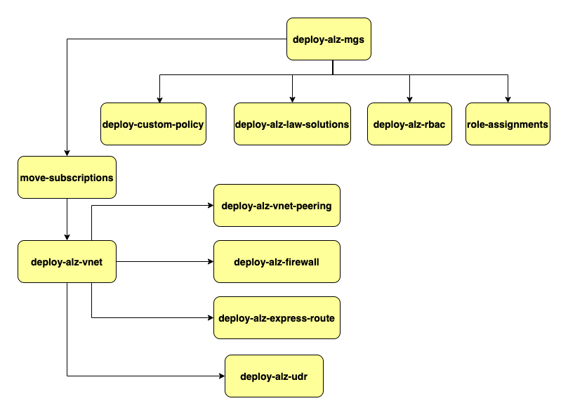

# Table of contents
## [Getting Started](#getting-started)
## [Pipeline Dependencies](#pipeline-dependencies)
## Pipelines
### [Management groups](#management-groups)
### [Move Subscription](#move-subscription)
### [Role Assignments](#role-assignments)
### [Custom Policy](#custom-policy)
### [Log Analytics Solutions](#azure-log-analytics-solution)
### [RBAC](#rbac)
### [Vnet and Subnet](#vnet-and-subnet)
### [User Defined Routes](#user-defined-routes)
### [Virtual Network Peering](#virtual-network-peering)
### [Azure Firewall](#azure-firewall)
### [Express Routes](#express-route)
## Additional Information
### [Custom Policy List](#custom-policy-list)
### [Log Analytics Solutions List](#log-analytics-solutions-list)
### [RBAC List](#rbac-list)

# Getting Started
To work on this project, you should have the git client and an editor (VS Code is free and capable)

The infrastructure will be defined using [Bicep](https://docs.microsoft.com/en-us/azure/azure-resource-manager/bicep/overview?tabs=bicep)

If this is your first time using git, you will need to tell it your name and email address. This can be done using the following two commands (making the obvious changes)

`git config --global user.name "Your Name"`

`git config --global user.email you@example.com`
test commit
# Pipeline Dependencies



# Pipelines

## Management Groups

This pipeline is used to deploy [Management Group](https://docs.microsoft.com/en-us/azure/governance/management-groups/overview) Heirarchy.

### Management Group Code

```
config/management-groups/mg.parameters.json
landingzone/management-group.bicep
azresources/management-groups.bicep
```

### Pipeline Code

```
.pipelines/deploy-alz-management-group-heirarchy.yml
```

### Pipeline Name

```
deploy-alz-mgs
```

## Move Subscription

This pipeline is used to [move subscriptions](https://docs.microsoft.com/en-us/azure/governance/management-groups/manage) to Management Group.

### Move Subscription Code

```
config/subscriptions/movesub.parameters.json
landingzone/move-subscription.bicep
azresources/move-subscription.bicep
```

### Pipeline Code

```
.pipelines/move-subscription.yml
```

### Pipeline Name

```
move-subscription
```

## Role Assignments

This pipeline is used to assign [roles](https://docs.microsoft.com/en-us/azure/role-based-access-control/overview) to existing User or Groups.

### Role Assignments code

```
config/role-assignments/ra.parameters.json
landingzone/role-assignments.bicep
azresources/role-assignments.bicep
```

### Pipeline Code

```
.pipelines/deploy-alz-role-assignment.yml
```

### Pipeline Name

```
role-assignments
```

## Custom Policy

The [custom policy](https://docs.microsoft.com/en-us/azure/governance/policy/overview) & policy sets are used when built-in alternative does not exist. This pipeline is used to deploy Custom Policy in Management Groups. Please check the [Additional Information](#custom-policy-list) for list of Policy deployed.

### Custom Policy Code

```
config/policy/custom
policy/custom/
```

### Pipeline Code

```
.pipelines/deploy-custom-policy.yml
```

### Pipeline Name

```
deploy-custom-policy
```

## Azure Log Analytics Solution

This pipeline deploys Azure [Log Analytics Solutions](https://docs.microsoft.com/en-us/azure/azure-monitor/insights/solutions?tabs=portal#log-analytics-workspace-and-automation-account). Please check the [List of Solutions](#log-analytics-solutions-list) for more details.

### LAW Solution Code

```
config/diagnostics/solutions.parameters.json
landingzone/solutions.bicep
azresources/solutions.bicep
```

### Pipeline Code

```
.pipelines/deploy-alz-solutions.yml
```

### Pipeline Name

```
deploy-alz-law-solutions
```

## RBAC

This pipeline creates custom [roles](https://docs.microsoft.com/en-us/azure/role-based-access-control/overview) in Management Groups which can be later used to assign to users or service Principle. Please check the [List of RBAC roles](#rbac-list) for more details.

### RBAC Code

```
config/rbac/rbac.parameters.json
rbac/rbac.bicep
```

### RBAC Pipeline Code

```
.pipelines/deploy-alz-rbac.yml
```

### RBAC Pipeline Name

```
deploy-alz-rbac
```

## VNET and Subnet

This pipeline is used to create the [Virtual Networks](https://docs.microsoft.com/en-us/azure/virtual-network/virtual-networks-overview) and subnets associated with it for each env. The VNets, subnets are for each env and is separated in config and contains parameters file for each environment – Hub, Dev and Prod.

### VNET and Subnet Code

```
config/network/$(env)/vnet.parameters.json
landingzone/vnets.bicep
azresources/vnet.bicep
```

### Pipeline Code

```
.pipelines/deploy-vnet.yml
```

### Pipeline Name

```
deploy-alz-vnet
```

## User Defined Routes

This pipeline is used to create [UDRs](https://docs.microsoft.com/en-us/azure/virtual-network/virtual-networks-udr-overview) for all env and associate UDRs to subnets. The UDRs are for each env and is separated in config and contains parameters file for each environment – Hub, Prod and Dev.

### UDR Code

```
config/network/$(env)/udr.parameters.json
landingzone/udrs.bicep
azresources/udr.bicep
```

### Pipeline Code

```
.pipelines/deploy-alz-udr.yml
```

### Pipeline Name

```
deploy-alz-udr
```

## Virtual Network Peering

This pipeline is used to create [VNet peering](https://docs.microsoft.com/en-us/azure/virtual-network/virtual-network-peering-overview) between hub vnets and all other envs - Prod and Dev. The VNet peerings are for each env and is separated in config and contains parameters file for each environment – Hub, Prod and Dev. Each env has the parameter file.

### VNET Peering Code

```
config/network/$(env)/peering.parameters.json
landingzone/peerings.bicep
azresources/peering.bicep
```

### Pipeline Code

```
.pipelines/deploy-vnet-peering.yml
```

### Pipeline Name

```
deploy-alz-vnet-peering
```

## Azure Firewall

This pipeline is used to deploy [Azure Firewall](https://docs.microsoft.com/en-us/azure/firewall/overview) in Hub. There are 2 Firewalls each for Dev and Prod subnets in Hub.

### Azure Firewall Code

```
config/network/hub/dev-azureFirewall.parameters.json
config/network/hub/prod-azureFirewall.parameters.json
landingzone/azure-firewall.bicep
azresources/azureFirewallPolicy.bicep
azresources/firewallRuleCollecyion.Bicep
azresources/azureFirewall.bicep
```

### Azure Firewall Pipeline Code

```
.pipelines/deploy-alz-firewall.yml
```

### Azure Firewall Pipeline Name

```
deploy-alz-firewall
```


# Additional Information

## Custom Policy List

List of Policy Deployed as follows: 

### Additional General Policy Controls

* Allowed Azure Regions for Resources

### Additional VM Policy Controls

* Allowed VMs SKU type

### Log Analytics for Azure Services

* Deploy Diagnostic Settings for Virtual Network to Log Analytics Workspaces
* Deploy Diagnostic Settings for Virtual Network Gateway to Log Analytics Workspaces
* Deploy Diagnostic Settings for Traffic Manager to Log Analytics Workspaces
* Deploy Diagnostic Settings for Synapse workspace to Log Analytics Workspaces
* Deploy Diagnostic Settings for Subscriptions to Log Analytics Workspaces
* Deploy Diagnostic Settings for SQLDB Database to Log Analytics Workspaces
* Deploy Diagnostic Settings for Recovery Vault for Site Recovery Events
* Deploy Diagnostic Settings for Recovery Vault for Azure Backup Events
* Deploy Diagnostic Settings for Network Security Groups to Log Analytics Workspaces
* Deploy Diagnostic Settings for Log Analytics Workspace
* Deploy Diagnostic Settings for Load Balancer to Log Analytics Workspaces
* Deploy Diagnostic Settings for IoT Hub to Log Analytics Workspaces
* Deploy Diagnostic Settings for Function App to Log Analytics Workspaces
* Deploy Diagnostic Settings for Express Route Circuit to Log Analytics Workspaces
* Deploy Diagnostic Settings for Event Grid Topic to Log Analytics Workspaces
* Deploy Diagnostic Settings for Event Grid System Topic to Log Analytics Workspaces
* Deploy Diagnostic Settings for Azure Container Registry to Log Analytics Workspaces
* Deploy Diagnostic Settings for Azure Application Gateway to Log Analytics Workspaces
* Deploy Diagnostic Settings for Automation Account to Log Analytics Workspaces
* Deploy Diagnostic Settings for App Service to Log Analytics Workspaces
* Deploy Diagnostic Settings for Analysis Service to Log Analytics Workspaces
* Deploy Diagnostic Settings for API Management to Log Analytics Workspaces
* Log Analytics Extension should be enabled for listed virtual machine images
* Virtual machines should be connected to a specified workspace
* Public IP addresses should have resource logs enabled for Azure DDoS Protection Standard
* Log Analytics extension should be enabled in virtual machine scale sets for listed virtual machine images
* Deploy Log Analytics extension for Linux virtual machine scale sets. See deprecation notice below
* Deploy Log Analytics extension for Linux VMs
* Deploy Diagnostic Settings for Stream Analytics to Log Analytics workspace
* Deploy Diagnostic Settings for Service Bus to Log Analytics workspace
* Deploy Diagnostic Settings for Search Services to Log Analytics workspace
* Deploy Diagnostic Settings for Logic Apps to Log Analytics workspace
* Deploy Diagnostic Settings for Key Vault to Log Analytics workspace
* Deploy Diagnostic Settings for Event Hub to Log Analytics workspace
* Deploy Diagnostic Settings for Data Lake Storage Gen1 to Log Analytics workspace
* Deploy Diagnostic Settings for Data Lake Analytics to Log Analytics workspace
* Deploy Diagnostic Settings for Batch Account to Log Analytics workspace
* Deploy Dependency agent for Linux virtual machines
* Deploy Dependency agent for Linux virtual machine scale sets
* Deploy - Configure diagnostic settings for Azure Kubernetes Service to Log Analytics workspace
* Deploy - Configure Log Analytics extension to be enabled on Windows virtual machines
* Deploy - Configure Log Analytics extension to be enabled on Windows virtual machine scale sets
* Deploy - Configure Dependency agent to be enabled on Windows virtual machines
* Deploy - Configure Dependency agent to be enabled on Windows virtual machine scale sets
* Configure diagnostic settings for storage accounts to Log Analytics workspace
* Audit diagnostic setting

### Tag Governance

Configures required tags and tag propagation from resource groups to resources. The policy definitions are:

* Audit missing tags on resource groups: Region
* Audit missing tags on resource groups: Organization
* Audit missing tags on resource groups: Department
* Audit missing tags on resource groups: BusinessOwner
* Audit missing tags on resource groups: TechnicalOwner

## Log Analytics Solutions List

List of Log Analytics Solutions Deployed :

* AgentHealthAssessment
* AntiMalware
* AzureActivity
* ChangeTracking
* Security
* SecurityInsights (Azure Sentinel)
* ServiceMap
* SQLAdvancedThreatProtection
* SQLVulnerabilityAssessment
* SQLAssessment
* Updates
* VMInsights

## RBAC List

* Custom - Landing Zone Application Owner
* Custom - Security Operations
* Custom - Network Operations
* Custom - Log Analytics - Read Only for VM Insights
* Custom - Landing Zone Subscription Owner
